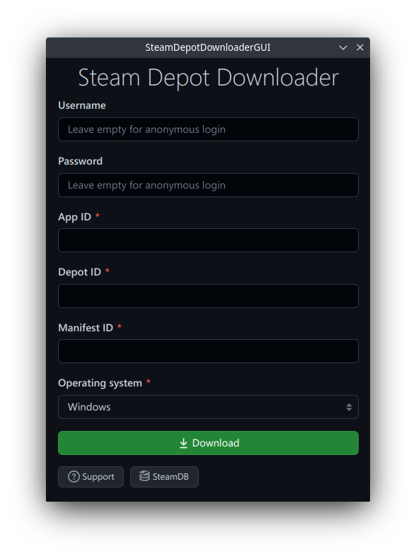

<h1 align="center">SteamDepotDownloaderGUI</h1>

  
  
  
  

  

SteamDepotDownloaderGUI is a graphical user interface for DepotDownloader.

You can download older versions of Steam games, useful for testing and speedrunners.

## Installation

Download the latest release for your operating system
from [GitHub](https://github.com/mmvanheusden/SteamDepotDownloaderGUI/releases/latest).

## Usage

Enter everything you normally would in the SteamDepotDownloader console.

There is a video tutorial available [here](https://www.youtube.com/watch?v=dQw4w9WgXcQ).

## Contributing

If you want to contribute to SteamDepotDownloaderGUI, please make sure to follow
the [contributing instructions and guidelines](contributing.md).

Pull requests are welcome. For major changes, please open an issue first to discuss what you would like to change.

Please make sure to keep code consistent and cross-platform compatible.

